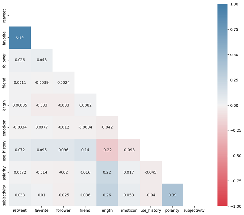

# Analysis of Tweets about iPhone14 and iPhone14Pro

 

#### -- Project Status: [Completed]

## Project Intro/Objective
The prpose of this group project is to use the Twitter API to build a database, then use the database to reveal the information included within. 

### Team Members
* Avinash Chekuru
* Jamison Proctor
* Ling Yee Khor
* Michael Flury

### Methods Used
* Inferential Statistics
* Data Collection with API

### Technologies
* Twitter API 2.0
* Python
* Pandas
* Numpy

## Project Description
The group project involved scraping tweets with hashtags #iPhone14 and #iPhone14Pro during the 10-day period after the launch of the products. We then analyzed the response from the Twitter users regarding these new products. After the end of the project, I extended the analysis to look at the characteristics of the tweets (e.g., retweet, favorite, length, emoticon, positive words) and the tweeters (e.g., friends, followers, user history) and the link between them.
